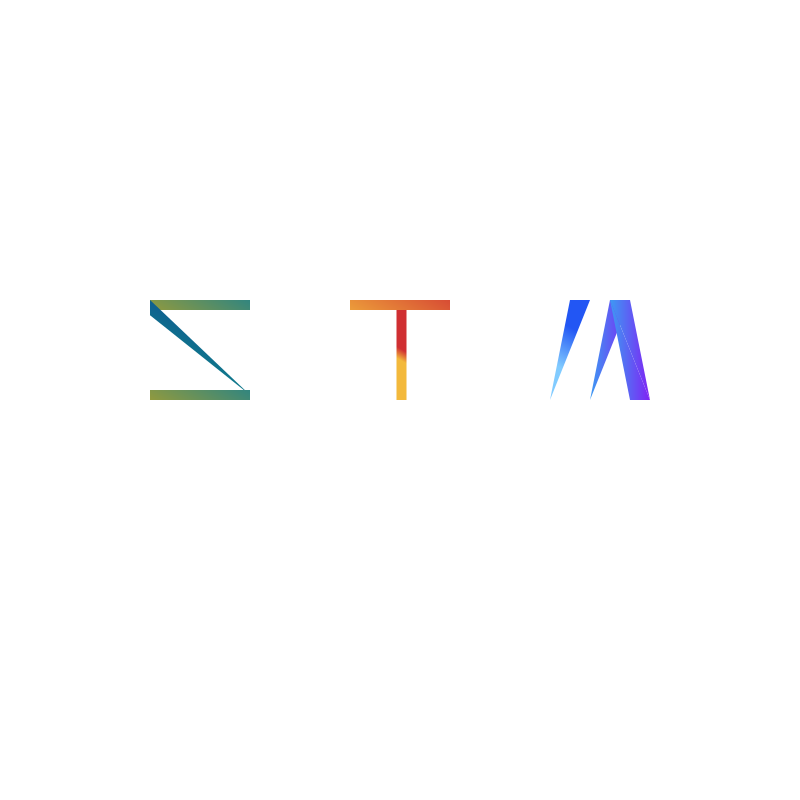

<!--
 * @Name: 
 * @Copyright: 
 * @Author: 
 * @Date: 24/12/23 11:23
 * @Description: 
-->

# 关于Stamon2

* CLimber-Rong在2023年二月份开发了简陋的第一代Stamon。在2023年7月份，CLimber-Rong决定开发第二代——Stamon2（以下简称Stamon）
* Stamon是一门面向对象的弱类型编程语言。
* Stamon可移植性极高，只需要实现为数不多的依赖库，Stamon就可以在你的平台上运行。

# 项目的文档，编译，运行
文档位于doc目录里，如果你想要阅读每次提交的内容以及对源码的解释，请阅读``doc/工作日志``目录下的文档

# 开发者
* Climber-Rong [Github主页](https://github.com/CLimber-Rong) [Gitee主页](https://gitee.com/QuXiangrong)

# 致谢
* TheFlySong [Github主页](https://github.com/TheFlySong)
* XIAOYI12 [Github主页](https://github.com/XIAOYI1212)
* min0911_ [Github主页](https://github.com/min0911Y)