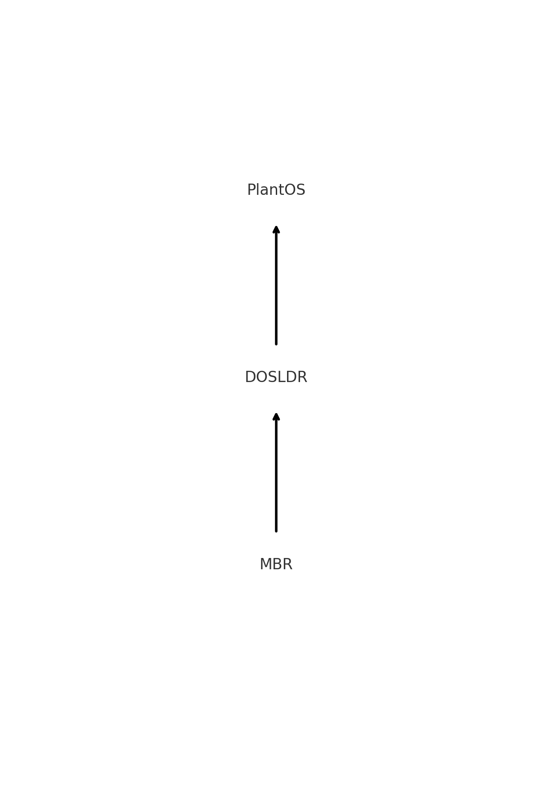

# Plant OS内核文档
**NOTE**: 本文档如未特别指出，一切路径都是在kernel文件夹下的，如dos/init/init.c 就是 kernel文件夹下的dos文件夹下的init文件夹下的init.c文件
## 启动

## 初始化
内核的**入口函数（Entry Point）** 是`KernelMain` （位于dos/init/main.c）
 - KernelMain会先调用一个被废弃的Check函数，然后调用`sysinit`(位于dos/init/init.c）进行初始化
### 初始化的具体内容
Plant OS内核的初始化主要是在`sysinit`函数中完成的
调用的第一个函数是
```c
do_init_seg_register(); // 初始化段寄存器
```
由于上面经过了DOSLDR的洗礼，段寄存器大多是乱的 所以我们需要全部重新初始化
```Assembly
do_init_seg_register:
  pusha
  mov ax,1*8
  mov gs,ax
  mov fs,ax
  popa
  ret
```
这样一番操作过后，所有段寄存器就正常了

接下来就是进行各种东西的设置、初始化。流程是
1. 初始化分页
2. GDTIDT的初始化 （即全局描述符表和中断描述符表的初始化）
3. 备份IVT，IVT会被一些脏数据覆盖，所以我们需要备份它，需要使用的时候我们重新拷贝到0x0-0x400物理地址的位置
4. 初始化8295A中断控制器
5. 初始化一些临时缓冲区（键盘队列 鼠标队列等）
6. 初始化内核堆（分配了128MB），**这里有一个bug就是如果内存过少（或者某些极端情况）（但实际上并没有耗尽），他会卡死**
7. 初始化第一个tty（文本模式tty），接下来就可以用printk打印信息了
8. 初始化PIT时钟
9. 初始化vdisk 存储设备（硬盘 软盘等）的抽象层
10. 初始化vfs
11. 注册FAT文件系统到vfs
12. 注册PFS到vfs
13. 初始化ACPI电源管理
14. 初始化SB16
15. 初始化输入栈 **（非CPU上的栈 只是一个数据结构实现）**
16. 初始化socket
17. 初始化一个目前还没有用的feature （mount disk，用于注册内存盘到vdisk）

## 分页（Paging）主要代码在 dos/mm/page.c
Plant OS将0x70000000以上的内存留给了应用程序，0x70000000以下的内存留给了内核，我们有page_malloc_one_count_from_4gb（该函数的作用就是从内存的后方开始分配，而不是前方，因为我们要保证内核所访问的内存要与物理内存一一对应）就是为这个准备的
以上就是Plant OS内存分页机制最大的特点
（待补充）
## 多软仵 dos/task/mtask.c
Plant OS的多任务是软件多任务，没有优先级机制（需要改进之处，待添加），程序运行权重通过`timeout`来决定，又通过`urgent`和`train`来辅助
### timeout
顾名思义，即每个任务所占用的时间片，理论上，timeout越长，这个任务占用的时间片就越多，那么相应的，别的任务所占有的时间片也就越少
> min0911点评：缺点是别的任务容易饿死（
### urgent
英语词典解释：adj.紧急的;迫切的;紧迫的;急切的;催促的;
那么顾名思义，就是这个任务需要紧急处理，可以起到一个优先级的作用，但是**治标不治本**
功能：调度器会优先调度设置该属性的任务